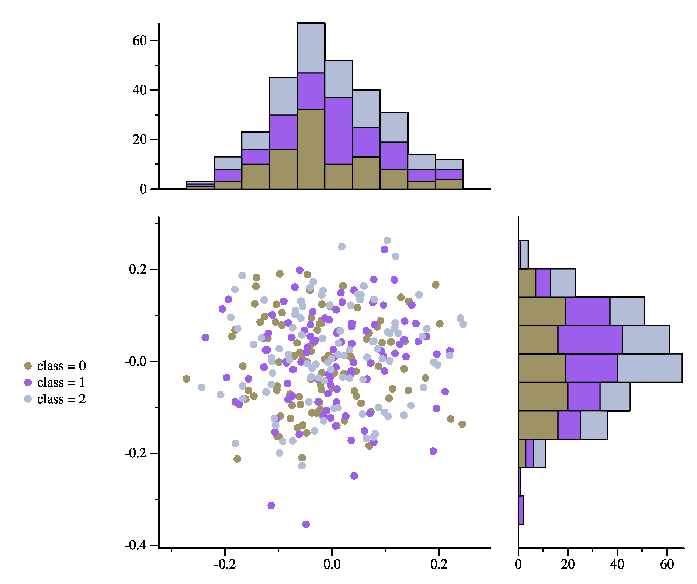
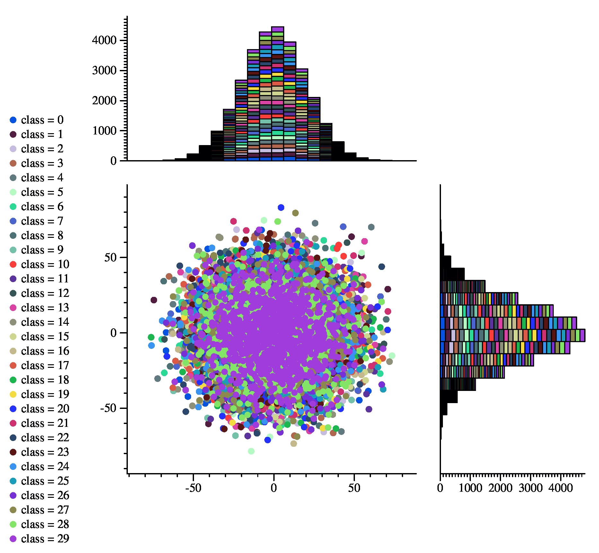

# JGraph Histograms

## Data Format
Files should be formatted as follows:
```
x y class
x y class
...
```

Comments can be denoted by prefixing a line with `#` 

### Sample Data
A program called `normal_data_maker.py` will create data in normal distributions 
with options to change the standard deviation, number of points, and number of 
classes generated. 

Another (more interesting) script called `random_data_maker.py` will select, 
at random, from a set of various types of random distributions, and generate 
a specified number of classes and points in the same way that `normal_data_maker.py` does. The difference is that each *class* has a different
random distribution (normal, logistic, laplacian, etc.). 

## Examples

Using 3 classes, each with 10 points and a normal distribution:


As a ridiculous example, Using 30 classes, each with 100 points (30,000 points total) on a normal distribution and 20 bins:


## Running For Yourself
This utility utilizes Python (don't hate me). The only packaged leveraged is the numpy, a package installed in nearly every
environment (including the EECS Hydras). If it's not, simply run `pip install numpy` and you're good to go. 

Included is a Makefile that will generate random data from a variety of distributions and create pretty graphs. 
Specifically, it will create 5 graphs with the following conditions:
1. 3 classes, each with a normal distribution and 100 points. 10 bins
2. 30 classes, each with a normal distribution and 100 points. 10 bins (this one is excessive)
3. 3 classes, each with a different random distribution and 100 points. 10 bins
4. 3 classes, each with a different random distribution and 100 points. 30 bins
5. 2 classes, each with a different random distribution and 10 points. 20 bins

The jgraphs go into the `jgraphs` folder, and jpg images go into the `graphs` folder. 
